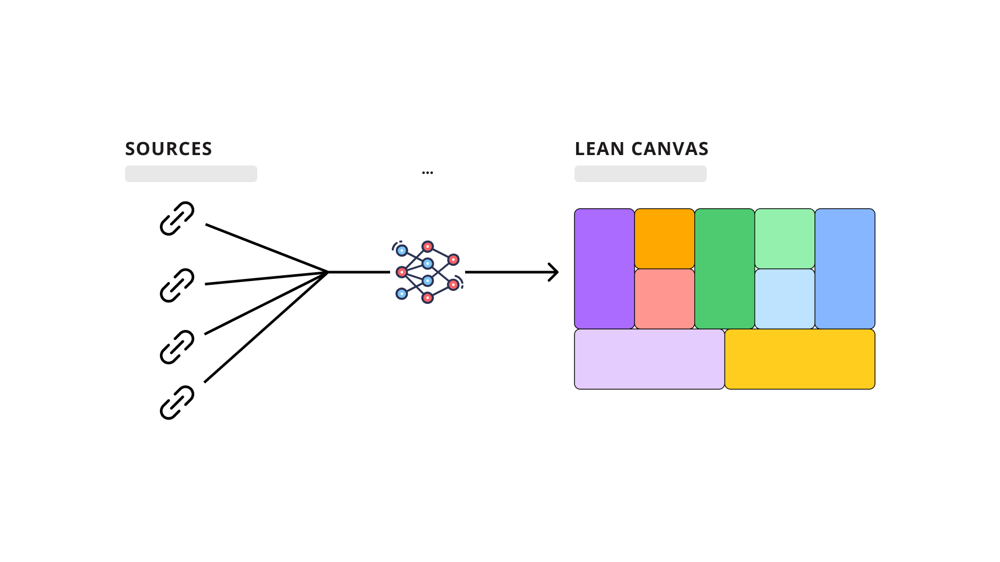
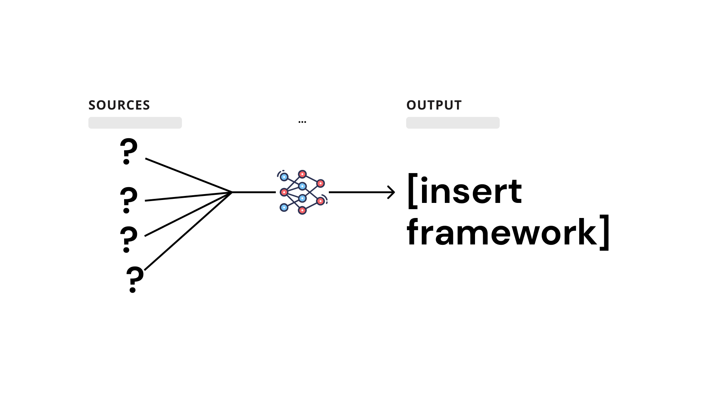
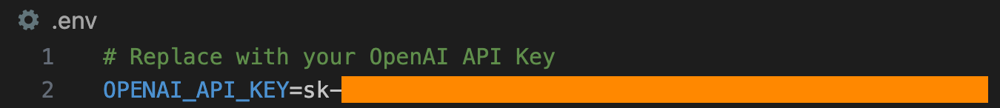
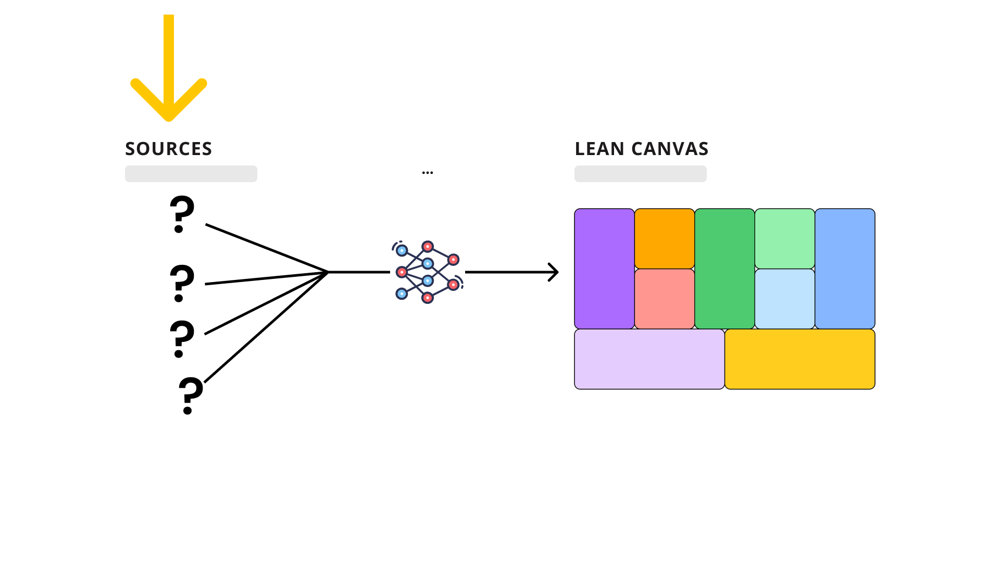

# frameSmith


***frameSmith*** scrapes information from the web and YouTube videos, and uses an OpenAI LLM to intelligently compress this raw information into any framework you define. It comes preconfigured to generate a [Lean Canvas](https://www.leancanvas.com/), which summarizes a product or company's strategy.

<div align="center">

</div>

The user starts by gathering web sources (blogs, news articles, YouTube videos) that contain high-quality information related to the company of interest. Then, the user lists the questions needed to generate each section of the framework. An AI will then scour the sources and summarize relevant information in order to "fill-in" each section of the framework.

<div align="center">

</div>

## Setup
1. Clone this repository, and navigate into the folder.
```
gh repo clone tmk1221/frameSmith
cd frameSmith
```

2. Create a virtual environment, and install the Python dependencies.
```
virtualenv venv
source venv/bin/activate
pip install -r requirements.txt
```

3. Create a file in the root directory called `.env`, and add your OpenAI API key as shown below. No quotes necessary.

    

4. Update the variables within `./config.json` to match the product/company you want to analyze.
    1. `product`: Product/company name as its referred to in the sources you provide

    2. `openai_model`: OpenAI model used to generate the framework

        At the time of writing, the most common options are: "gpt-3.5-turbo" or "gpt-4". GPT-4 is a more powerful model, but will cost more to use. For up-to-date information about available models, see [OpenAI's Model Overview](https://platform.openai.com/docs/models/overview)

    3. `news_urls`: Websites, blog posts and/or news articles related to your product/company, and that contain the information needed to fill in the sections of your framework

        - You need to provide at least 1 URL here for the bot to run.

        - BeautifulSoup is used to scrape text from these websites. The text then goes through a cleaning step. You may want to print the texts afterwards to ensure that the texts were scraped and cleaned in the way you expected. See line 36 in `src/framework_generator.py` for what I mean.

    4. `youtube_urls`: YouTube videos related to your product/company

        - You do not need to provide any YouTube videos for the bot to run. If you do not want to use any YouTube videos, then replace the brackets with `None` in the `./config.json`.

        - Transcript texts are captured via YouTube's API. Some YouTube videos don't have transcripts. If this is the case, it's okay, the API will just return an empty string.

    5. `prompt_template`: Every prompt sent to OpenAI LLM is based on this template.

        You can change the AI's responses based on the description you give it here (e.g. "You are an experienced Market Research professional who words things as simply as possible, and usese marketing terminology whenever appropriate.")

        Notice the bracketed variables within the text string: {product}, {context}, {chat_history}, {human_input}. These exact variables must be present in whatever you change the prompt_template to. The {product} is self-explanatory. {context} is where the relevant documents are inserted from the sources you provided. {chat_history} feeds in the last question-answer pair. And, finally, {human_input} is the specific query for that prompt (e.g. "Q1...").

    6. `framework_questions`: The questions needed to generate the sections of your framework. The default is for a Lean Canvas.

        Notice the `{product}` variable within the text strings. You need to mimic this exactly if you replace them with your own questions.

        It's likely that ***all*** the information needed to generate each section of your framework will ***not*** be present in the sources you provide. That's okay... notice how, in the lean canvas questions listed, each questions says something like: "If this information wasn't provided, list some plausible...". 
        
        This is good to include because (1) it prevents the AI from lying and pretending to have the answer when it does not, and (2) the AI will make an informed attempt (knowing what it has already seen about the product/company) at answering the question. In my experience the plausible suggestions turn out to be very good, and you end with a fully completed framework where the AI makes clear where it guessed and where it had the information needed to answer the question from the sources.

## Usage
1. Run frameSmith

    This takes several minutes to complete for the Lean Canvas use-case. The AI essentially asks each framework question of the information sources you provided. Progress indicators awill print to your console.

    ```
    python3 ./src/generate.py
    ```

2. Find your framework in `./framework_output`

## Adaptation Considerations
1. **Change data sources**

    Currently **frameSmith** is setup to scrape and clean data from blogs and news websites, and retreive transcripts from YouTube videos. Thus, data is loaded via URLs, which is limited considering the diversity of data sources in existence.

    Langchain supports [100+ document loaders](https://python.langchain.com/docs/integrations/document_loaders) with which you can load data from specific sources. You can look into replacing lines 16-39 in `./lean_canvas_generator.py` to do this.

<div align="center">

</div>

2. **Tradeoffs with Document Splitting**
    
    Document splitting refers to how entire documents are split into smaller documents. This is necessary because usually entire documents exceed LLM context windows (e.g. 32k tokens for GPT-4). The current implementation is to split the scraped web texts and transcripts into documents of 1000 character chunks.

    There is a tradeoff between larger and smaller documents. Larger documents will provide more context to the LLM; however, the embeddings are less specific for larger documents. This has the effect of "diluting" the semantic meaning of the documents, which makes it more difficult to return relevant documents. Smaller documents, on the other hand, have more specific embeddings, but provide less context to the LLM. If documents are too small, they might only return part of the answer, where the rest gets cutout and placed in subsequent documents.

    There are workarounds for this. See Langchain's [Parent Document Retriever](https://js.langchain.com/docs/modules/data_connection/retrievers/how_to/parent-document-retriever), or for a more general discussion, see Pinecone's [Chunking Strategies for LLM Applications](https://www.pinecone.io/learn/chunking-strategies/).

    In any case, if **frameSmith** performance suffers, document splitting is one of the first places I would look to optimize things. It plays a big part in the quality and relevance of the documents that get passed into the LLM prompt.